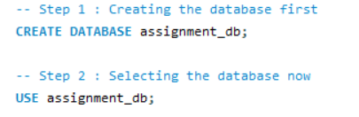
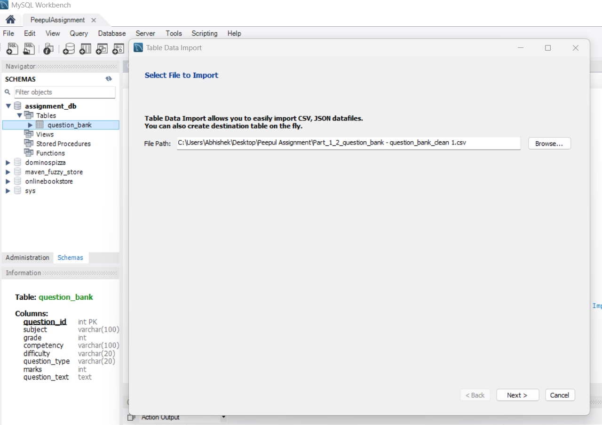
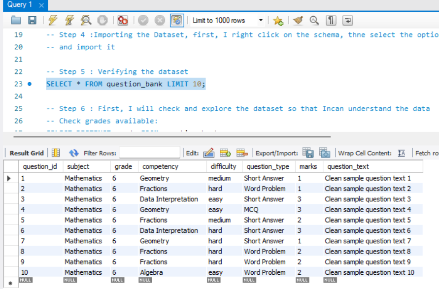
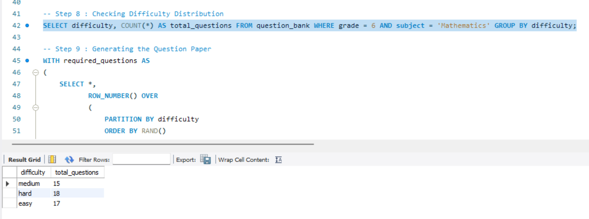
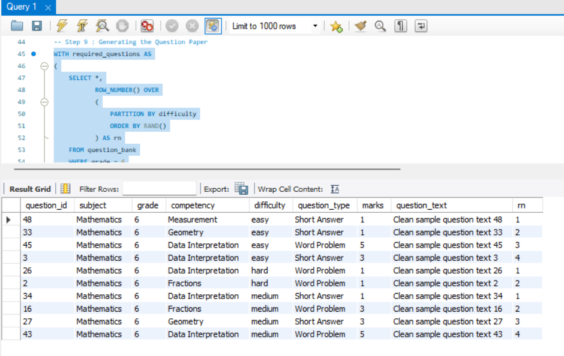
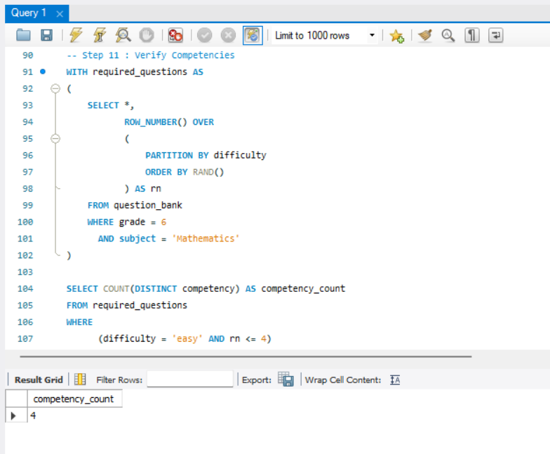

# Assessment Generator and Question Bank Analytics

## 📖 Overview

This project demonstrates an end-to-end solution for question paper generation, data cleaning, and basic system design using SQL and Python.

The project was completed as part of an **Associate, Data & Technology Assignment** and focuses on:

- SQL-based question paper generation
- Python automation for assessment creation
- Data cleaning and standardization
- Question bank analysis
- System design for automated reporting workflows

---

## 🎯 Problem Statement

The objective was to build a simple assessment generation system using a question bank dataset.

The project includes:

1. Generating a Grade 6 Mathematics question paper using SQL.
2. Building a Python program to generate question papers based on a blueprint configuration.
3. Cleaning and standardizing a messy question bank dataset.
4. Designing a workflow for automated weekly dashboard summary reporting.

---

## 🛠️ Technologies Used

- Python
- Pandas
- SQL
- MySQL Workbench
- Microsoft Excel
- Git & GitHub

---

## 📁 Project Structure

```text
Assessment-Generator-and-Question-Bank-Analytics/
│
├── Sql_Screenshots/
│   ├── Creating_Database.png
│   ├── Importing_Dataset.png
│   ├── Dataset_Preview.png
│   ├── Difficulty_Distribution.png
│   ├── Question_Paper_Output.png
│   └── Competency_Validation.png
│
├── Abhishek_Savita_Assignment_Report.docx
├── README.md
│
├── part1_sql_query.sql
├── part2_generate_question_paper.py
├── cleaned_question_bank.py
│
├── generated_question_paper.csv
└── cleaned_question_bank.csv
```

---

# Part 1 - SQL Task

## Objective

Generate a Grade 6 Mathematics question paper with:

- Total Questions: 10
- Easy Questions: 4
- Medium Questions: 4
- Hard Questions: 2
- No Duplicate Questions
- Minimum 3 Competencies

## Approach

- Imported the question bank dataset into MySQL Workbench.
- Explored grades, subjects, difficulties, and competencies.
- Filtered Grade 6 Mathematics questions.
- Used SQL filtering and window functions to select questions according to the blueprint.
- Validated competency coverage and difficulty distribution.

## SQL Concepts Used

- SELECT
- WHERE
- Common Table Expressions (CTE)
- ROW_NUMBER()
- PARTITION BY
- ORDER BY
- Window Functions
- Data Filtering

---

# Part 2 - Python Task

## Objective

Build a Python-based assessment generator that creates question papers using a configurable blueprint.

## Features

- Reads question bank dataset
- Accepts blueprint configuration
- Filters questions by grade
- Selects questions according to difficulty distribution
- Prevents duplicate question selection
- Displays competency-wise distribution
- Exports generated question paper as CSV

## Blueprint Used

```python
{
    "grade": 6,
    "total_questions": 10,
    "difficulty_distribution": {
        "easy": 4,
        "medium": 4,
        "hard": 2
    }
}
```

## Output

Generated file:

```text
generated_question_paper.csv
```

---

# Part 3 - Data Cleaning

## Objective

Clean and standardize a messy question bank dataset for reliable assessment generation.

## Cleaning Steps Performed

### Subject Standardization

Examples:

```text
MATH  → Mathematics
math  → Mathematics
```

### Difficulty Standardization

Examples:

```text
E      → easy
Easy   → easy
EASY   → easy

H      → hard
Hard   → hard
```

### Competency Cleaning

- Removed extra spaces
- Standardized formatting

### Question Type Cleaning

Examples:

```text
mcq → MCQ
```

### Grade Cleaning

- Converted grades into numeric format
- Removed records with missing grades

### Marks Cleaning

- Converted marks into numeric format
- Filled missing values using median value

### Duplicate Handling

- Checked duplicate question IDs
- Checked duplicate question texts
- Removed duplicate records where required

### Date Standardization

- Converted date values into datetime format

## Assumptions

- Missing difficulty values were standardized as `"unknown"` to avoid unnecessary data loss.
- Missing creator information was retained as `"Unknown"`.
- Missing dates were preserved because a question may not have been used previously.

## Output

Generated file:

```text
cleaned_question_bank.csv
```

---

# Part 4 - System Design

## Scenario

Design a system that automatically sends weekly dashboard summaries to program teams through Email, Microsoft Teams, or Slack.

## Components

- Data Source
- Database
- Python Processing Script
- Dashboard Tool
- Scheduler
- Notification Service
- Logging System

## Data Flow

```text
Database
    ↓
Processing Script
    ↓
Dashboard
    ↓
Summary Report
    ↓
Email / Teams / Slack
```

## Failure Handling

- Logging
- Retry Mechanism
- Validation Checks
- Alert Notifications

---

## 📸 SQL Screenshots

The repository includes screenshots demonstrating the SQL workflow.

### Creating Database



### Importing Dataset



### Dataset Preview



### Difficulty Distribution



### Question Paper Output



### Competency Validation



---

## 📊 Key Learning Outcomes

- SQL-based data extraction and filtering
- Question paper generation using blueprint logic
- Python automation using Pandas
- Data cleaning and preprocessing
- Missing value handling
- Duplicate detection and removal
- Basic system design concepts
- Workflow automation thinking

---

## 👨‍💻 Author

**Abhishek Savita**

- GitHub: https://github.com/Abhishek-Savita-3012
- LinkedIn: https://linkedin.com/in/abhishek-savita-b41961276
